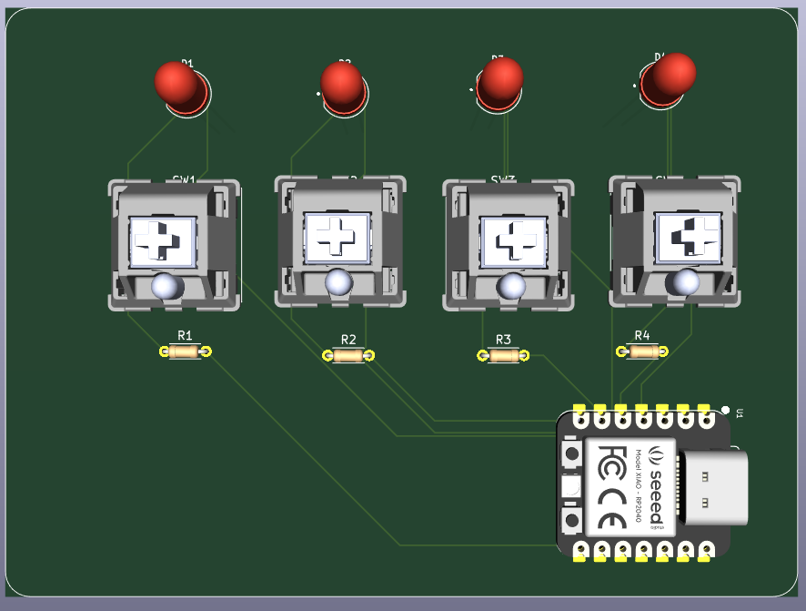
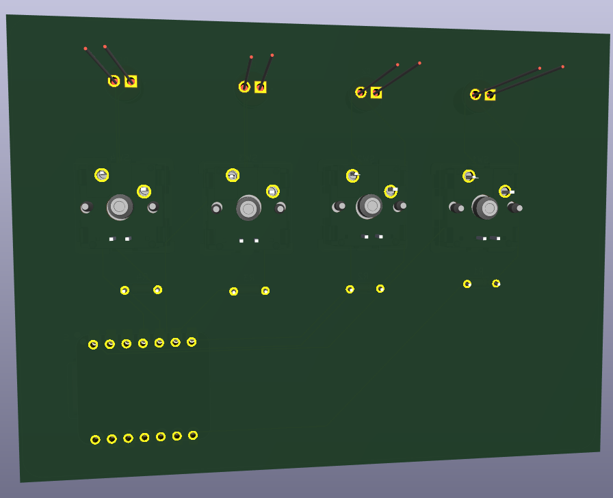
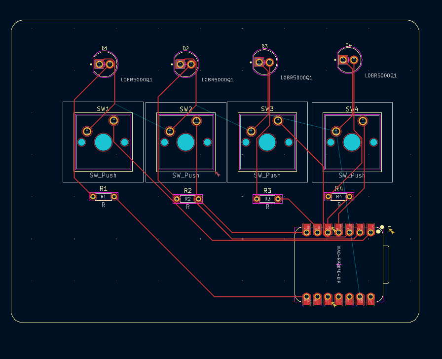

# PCB Projects

This repository contains custom PCB designs created using KiCad. It includes schematic files, PCB layouts, manufacturing-ready files, and supporting documentation.

## Repository Structure

- `Schematics/` - Circuit schematics
- `PCB Layouts/` - Board layout files
- `Gerber Files/` - Fabrication files for PCB manufacturers
- `3D Models/` - Optional board renderings
- `Images/` - PCB renders and real images
- `Docs/` - Datasheets and reference documents

## How to Use

1. Open `.kicad_sch` and `.kicad_pcb` files in KiCad
2. Modify as needed
3. Export Gerber files
4. Send to a PCB manufacturer
5. Solder components and test the board

## PCB Preview

## License

This project is licensed under the MIT License.
